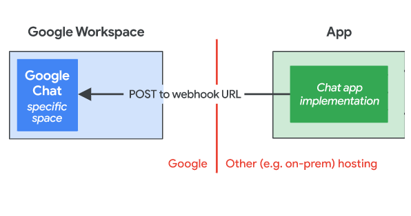
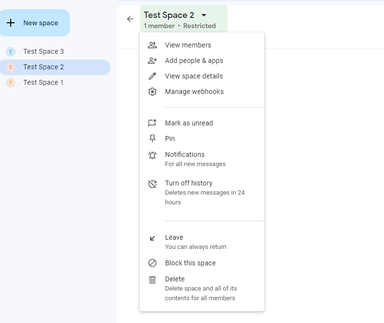
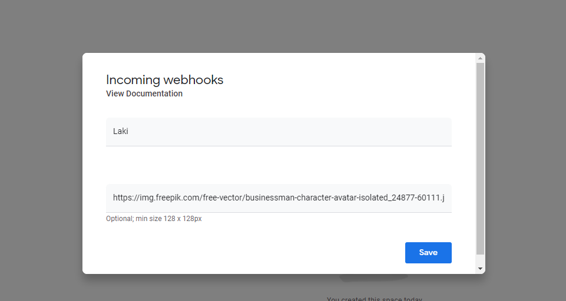
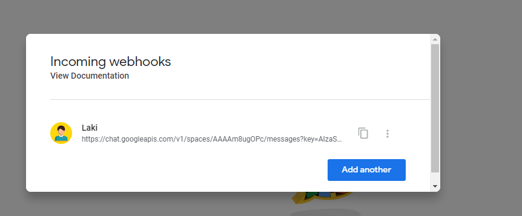
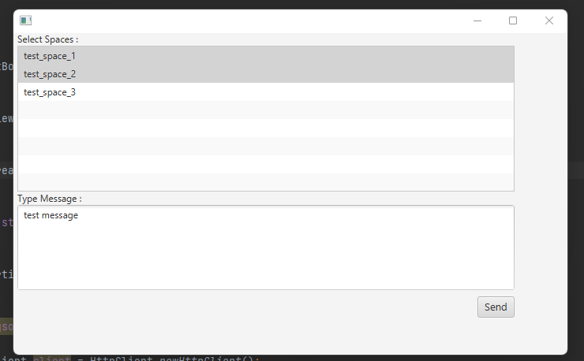
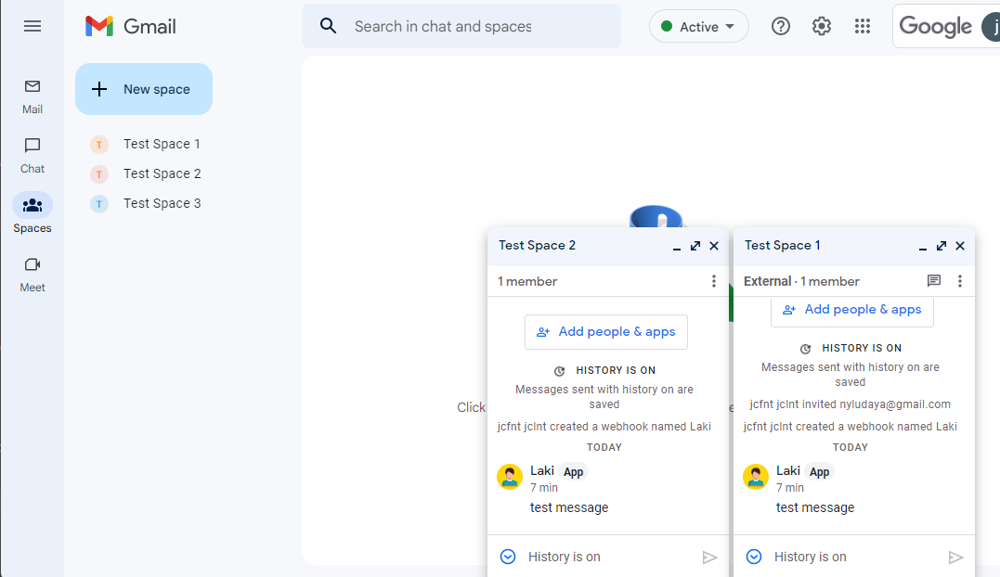

***Note that following configuration can be done only for a Google admin workspace account. Since the configuration is not 
possible for a normal gmail account, this application cannot be used for to post messages to spaces in a normal gmail account.***

This application use incoming webhooks to send messages to google chat spaces

https://developers.google.com/chat/how-tos/webhooks

### Prerequisites to setup development environment
1. java 19 openjdk 
2. maven 3.8
### How to run from intellij
1. Import the project in Intellij
2. Update <project_root>/conf/space_to_webhook.properties with space name and bot url. Follow the below steps to create the bot url for each space.
   1. Click on the Manage Webhook menu. 
   2. Fill the name(Sender name) and image url(whatever image url). 
   3. Copy the bot url in this window. 
3. Run the App class to run the project.

### How to run the project from jar
1. Update the space_to_webhook.properties as specified above
2. run mvn clean package from project root
3. go to the target folder
4. run project with `java -jar jclass-post-message-1.0.0.jar`

### Run from release
1. Download the binaries from release section https://github.com/laki88/gchat-post-message/releases/tag/v1.0.0
2. Extract and update the chatpost\conf\space_to_webhook.properties as specified above
3. For windows run the run.bat. For Linux and Mac run the run.sh

When the application run window like below will appear and you need to select spaces, type the message and click the send button.

message should arrive like below

